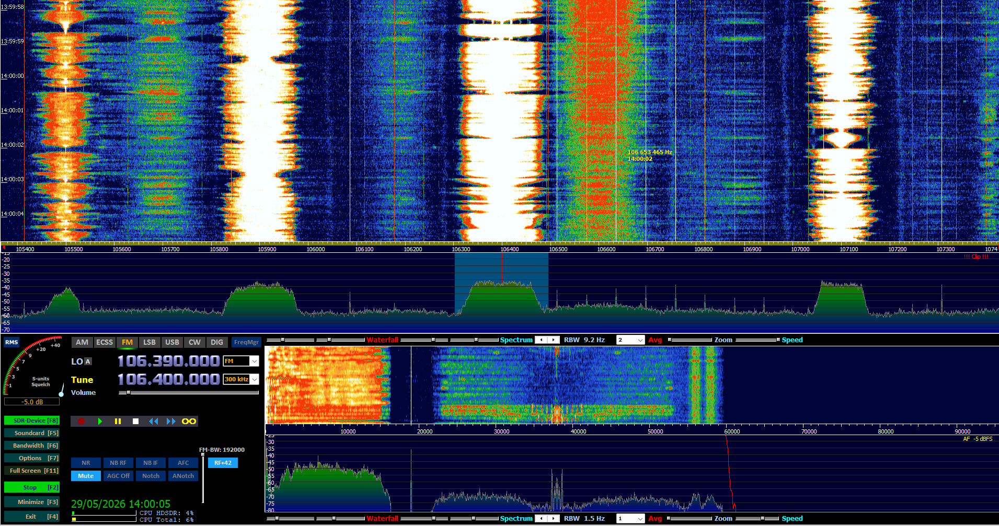
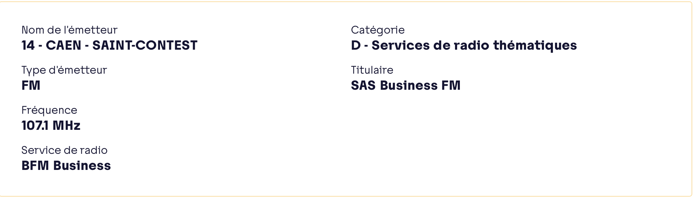
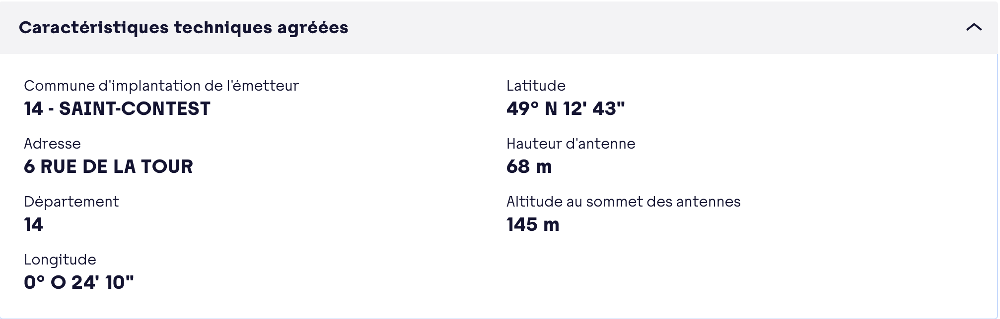
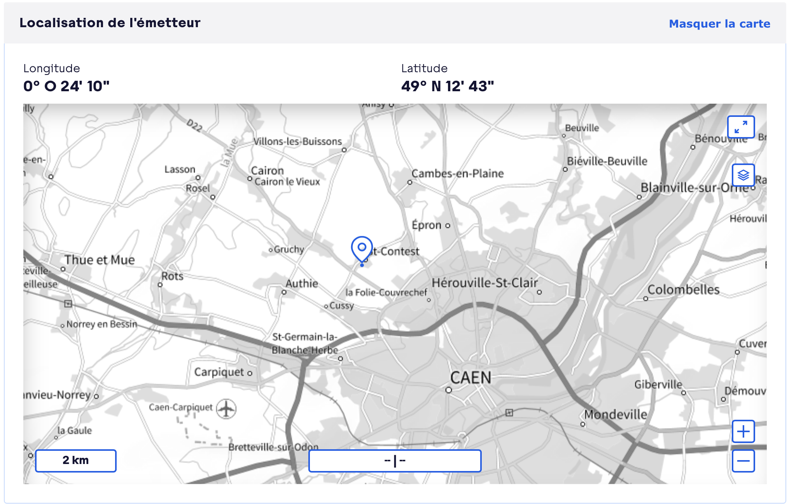
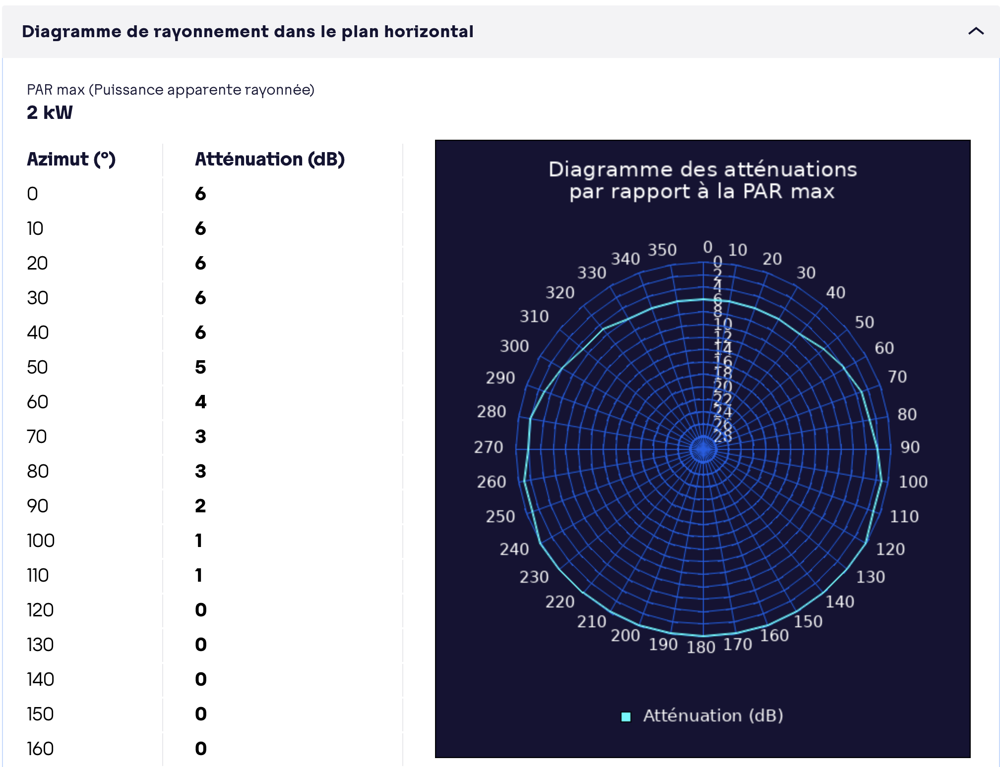
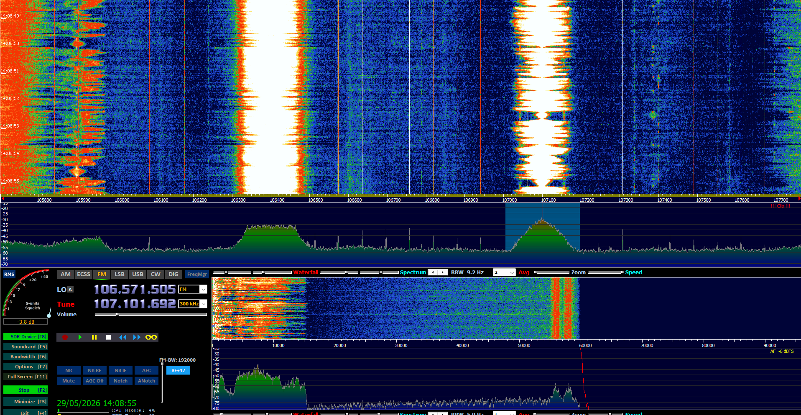
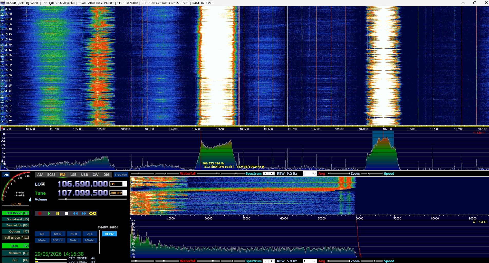
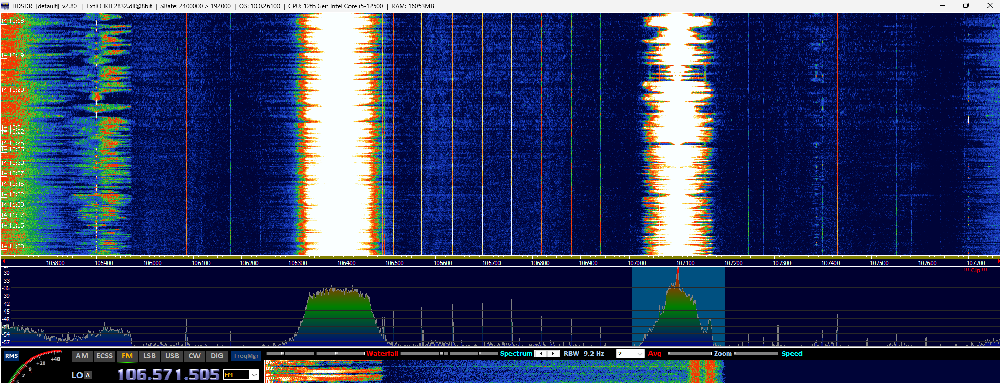

# Compte rendu - FM commerciale et BFM Business | Matthieu leconte

## Spectre FM

Le signal FM démodulé est composé de plusieurs parties :

| Partie         | Fréquence   | Utilité                        |
|----------------|------------:|--------------------------------|
| Audio mono L+R | 0 à 15 kHz  | Son principal, compatible mono |
| Pilote         | 19 kHz      | Repère pour décoder la stéréo  |
| Stéréo L-R     | 23 à 53 kHz | Séparation gauche/droite       |
| RDS            | 57 kHz      | Données de la station          |

Le signal pilote à 19 kHz sert à reconstruire la référence à 38 kHz pour la stéréo :

```text
19 kHz x 2 = 38 kHz
19 kHz x 3 = 57 kHz
```

Le RDS signifie `Radio Data System`. Il permet d'afficher des informations comme le nom de la station, du texte, le type de programme ou des fréquences alternatives.

## Multiplexage FDM

La FM utilise le multiplexage en fréquence : chaque station radio occupe une fréquence différente.

Exemples :

| Exemple | Utilisation |
|---|---|
| Radio FM | Une fréquence par station |
| ADSL | Séparation téléphone / débit montant / débit descendant |
| TV ou câble | Plusieurs canaux séparés |

Limites : il faut assez de bande passante, laisser des écarts entre les canaux et utiliser des filtres corrects pour éviter les interférences.

## Antenne

Pour une antenne quart d'onde :

```text
La = lambda / 4
lambda = c / F
```

Pour la FM autour de 100 MHz :

```text
lambda = 3,0 x 10^8 / 100 x 10^6 = 3,0 m
La = 3,0 / 4 = 0,75 m
```

La longueur optimale est donc d'environ `75 cm`.

Pour BFM Business à `107,1 MHz` :

```text
lambda = 3,0 x 10^8 / 107,1 x 10^6 = 2,80 m
La = 2,80 / 4 = 0,70 m
```

La longueur d'antenne adaptée est donc d'environ `70 cm`.

## HDSDR

La station Nostalgie est réglée sur `106,4 MHz`.



On voit une bande FM large autour de la fréquence porteuse. Le signal ressort nettement du bruit de fond.

Pour le réglage `192000` car c'est la seule fréquance dans la limite de shanon que hdsdr frournis :

| Question | Réponse |
|---|---|
| Unité | Hz, donc `192000 Hz = 192 kHz` |
| Sampling Rate | fréquence d'échantillonnage |
| Output observé autour de la porteuse | bande passante / largeur de bande |

## BFM Business sur Arcom

Les informations Arcom indiquent :

| Élément   | Valeur                            |
|-----------|-----------------------------------|
| Service   | BFM Business                      |
| Fréquence | `107,1 MHz`                       |
| Émetteur  | `14 - CAEN - SAINT-CONTEST`       |
| Type      | FM                                |
| Catégorie | D - Services de radio thématiques |
| Titulaire | SAS Business FM                   |



## Émetteur

Adresse et position :

| Élément | Valeur |
|---|---|
| Adresse | 6 rue de la Tour |
| Commune | 14 - Saint-Contest |
| Longitude | 0° O 24' 10" |
| Latitude | 49° N 12' 43" |
| Hauteur d'antenne | 68 m |
| Altitude sommet antennes | 145 m |





L'émetteur est situé à Saint-Contest, au nord-ouest de Caen.

## Puissance et rayonnement

La puissance indiquée est :

```text
PAR max = 2 kW = 2000 W
```

Conversion en dBm :

```text
P(dBm) = 10 x log10(2000 x 1000)
P(dBm) = 63,0 dBm
```

Donc la puissance est d'environ `63 dBm`.



Atténuation maximale visible :

```text
6 dB -> 10^(-6/10) = 0,25 W/W
```

L'atténuation maximale correspond donc à environ `25 %` de la PAR max.

Plein est correspond à `90°`. Sur le tableau Arcom :

```text
2 dB -> 10^(-2/10) = 0,63 W/W
```

Vers l'est, la puissance correspond donc à environ `63 %` de la PAR max.

## Spectre de BFM Business

Réglage utilisé :

```text
Tune = 107,1 MHz
FM-BW = 192000 Hz
```



Le signal de BFM Business est bien visible autour de `107,1 MHz`. Il apparait sous forme d'une bande large dans le waterfall et ressort nettement du bruit.

## Spectre démodulé

Sur le spectre démodulé, on retrouve les parties attendues :

| Zone | Observation |
|---|---|
| 0 à 15 kHz | audio principal |
| 19 kHz | pilote stéréo |
| 23 à 53 kHz | information stéréo |
| autour de 57 kHz | RDS |

Occupation spectrale approximative :

| Partie | OBW |
|---|---:|
| Audio L+R | 15 kHz |
| Stéréo L-R | 30 kHz |
| Multiplex utile total | environ 60 kHz |

## Réglages FM-BW et qualité

Le réglage `FM-BW` correspond à la largeur du filtre de réception FM. Plus il est faible, plus le signal est coupé.

Avec `FM-BW = 90804 Hz`, la qualité devient mauvaise :



Avec `FM-BW = 192000 Hz`, la réception est meilleure :



Quand on baisse le filtre passe-bas :

| Réglage | Effet |
|---|---|
| Au-dessus de 60 kHz | le multiplex passe presque entièrement |
| Vers 19 kHz | la stéréo commence à être coupée |
| Sous 16 kHz | les aigus disparaissent, le son devient moins bon |
| Vers 3 à 4 kHz | qualité proche du téléphone |

## Bilan

BFM Business est reçu sur `107,1 MHz` depuis l'émetteur `14 - CAEN - SAINT-CONTEST`. L'antenne quart d'onde adaptée mesure environ `70 cm`. La PAR max est de `2 kW`, soit environ `63 dBm`. Le spectre reçu et le spectre démodulé montrent bien les différentes parties d'un signal FM : audio, pilote, stéréo et RDS.
